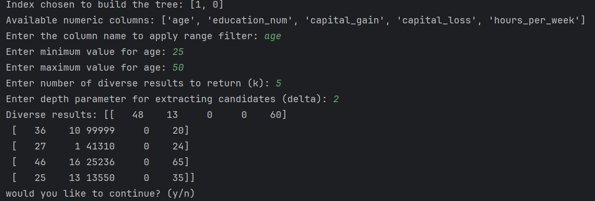

RC_INDEX

📌 Project Overview

RC_INDEX is a Python implementation of indexing and searching structures designed for efficient diverse range queries. Unlike traditional approaches that first compute all query results and then select a diverse subset, RC-Index reduces the number of retrieved items, optimizing both efficiency and diversity. The project is based on the RC-Index structure proposed by Wang et al., 2018, which provides strong approximation guarantees for selecting a diverse subset of results in range queries.

**Implemented Algorithms**

This project implements the following algorithms and data structures:

RC-Index: A hybrid indexing structure that integrates Range Trees and Cover Trees for efficient diverse range queries. It is based on the research presented in Wang et al., 2018.

Cover Tree: A hierarchical data structure used to organize data points efficiently and facilitate fast candidate extraction.

Range Tree: A balanced binary search tree that enables efficient multi-dimensional range queries, improving search time complexity.

Greedy Diversification: A selection algorithm used to ensure diversity in the retrieved results by iteratively selecting the most distant elements from the chosen set.

**Datasets Used**

The dataset used in this project is the Adult Income Dataset from the UCI Machine Learning Repository:

URL: Adult Dataset

Features include age, education level, income, work hours per week, and financial attributes.

We used only numeric attributes: age, education_num, capital_gain, capital_loss, hours_per_week.

The dataset is loaded using pandas and processed into NumPy arrays for indexing.

**Usage Example**   

from CoverTree import CoverTree
from RangeTree import RangeTree
from RC_INDEX import RCIndex

# Load sample numeric data
sample_data = numeric_data[:50000]
rc_index = RCIndex(sample_data)

# Perform a query
Index chosen to build the tree: [1, 0]
Available numeric columns: ['age', 'education_num', 'capital_gain', 'capital_loss', 'hours_per_week']
Enter the column name to apply range filter: age
Enter minimum value for age: 25
Enter maximum value for age: 50
Enter number of diverse results to return (k): 5
Enter depth parameter for extracting candidates (delta): 2
Diverse results: [[   48    13     0     0    60]
 [   36    10 99999     0    20]
 [   27     1 41310     0    24]
 [   46    16 25236     0    65]
 [   25    13 13550     0    35]]

Algorithm Details

The RC-Index is built using two randomly selected numeric attributes from the dataset. The selection is performed dynamically from all available numeric attributes, ensuring flexibility and adaptability to different datasets.

The distance function used in this implementation is the Euclidean Distance (L2-norm), and it is computed based on these two randomly selected attributes. This means that both the indexing structure and the diversification process operate within a randomly chosen two-dimensional subspace of the dataset, ensuring variation in query responses and preventing bias toward any specific attribute.

The Euclidean Distance satisfies the following properties:

Non-negativity: dist(x, x) = 0

Symmetry: dist(x, y) = dist(y, x)

Triangle Inequality: dist(x, y) + dist(y, z) ≥ dist(x, z)
This ensures that the selected diverse subset maintains meaningful spatial separation while optimizing computational efficiency.

This implementation follows the MAXSUM diversification criterion, which maximizes the sum of pairwise distances among selected items to ensure a diverse subset of results.

1. **RC-Index Construction**

   1. Construct Range Tree:
       Sort the dataset based on the chosen attribute.
    
       Recursively partition the data and build a hierarchical structure.
    
       Store Cover Trees at leaf nodes.

   2. Construct Cover Trees within each partition:

       Organize data hierarchically based on distance constraints.
    
       Assign each point to a level based on its proximity to cluster centers.

2. **Query Execution (Algorithm 1: Query Evaluation)**

   1. Range Query Extraction (Algorithm 3):

       Retrieve relevant Cover Trees using the Range Tree.
    
       If a node is fully within the query range, return its Cover Tree.
    
       If a node partially intersects, recursively explore its children.

   2. Candidate Extraction (Algorithm 2):

       Extract a subset of candidate points from the Cover Trees.
    
       If a Cover Tree has fewer than k points, return all of them.
    
       Otherwise, extract candidates from a specific level, determined by delta.

   3. Greedy Diversification (Algorithm 4):

       Select a random initial candidate.
    
       Iteratively choose the most distant candidate until k diverse results are obtained.
    
**Acknowledgments**
This project is based on the research presented in Wang et al., 2018, along with computational geometry concepts and open-source implementations.

**License**

This project is licensed under the MIT License.

